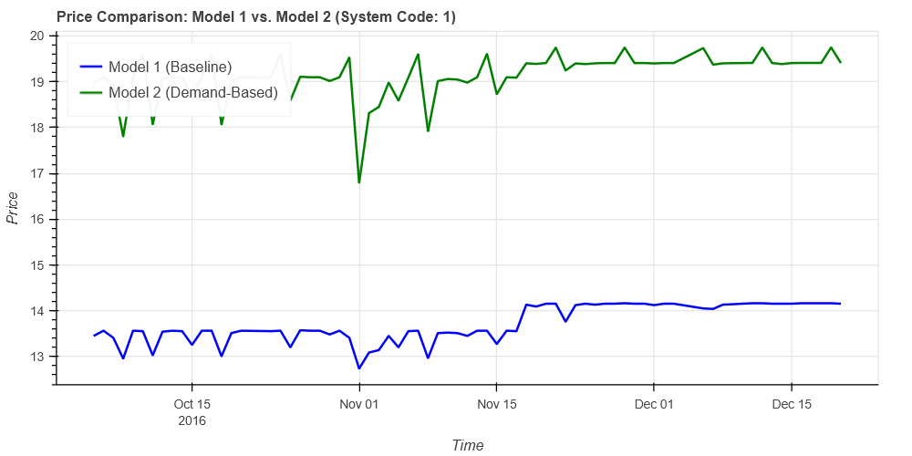

# Real-Time Demand-Based Pricing Engine

This repository contains a real-time data processing pipeline that calculates dynamic pricing for services like parking, toll roads, or rentals. The engine ingests a stream of raw operational data and applies a multi-factor demand model to compute a fair, responsive, and smoothed price.

The core logic is implemented using the [Pathway](https://pathway.com/) framework, which enables declarative, real-time data transformations that update automatically as new data arrives.

## Key Features

*   **Real-Time Processing:** Prices update in real-time as new data points are streamed into the system.
*   **Composite Demand Model:** The price is not based on a single metric. It intelligently combines occupancy, queue length, traffic conditions, and special events.
*   **Non-Linear Pricing:** Uses sigmoid and hyperbolic functions to model real-world demand curves more accurately.
*   **Bounded & Smoothed Pricing:** The final price is guaranteed to be within a predefined range (e.g., $5 to $20) and avoids jarring price jumps.
*   **Declarative & Maintainable:** The entire pipeline is defined in a clear, sequential, and easy-to-understand manner.

## Technology Stack

*   **Data Processing Framework:** [**Pathway**](https://pathway.com/)
    *   The core engine for building the real-time, stateful dataflow graph. It handles time-based windowing, incremental updates, and complex user-defined functions automatically.
*   **Programming Language:** **Python 3.x**
    *   The entire logic is written in Python, leveraging its simplicity and the powerful `math` library for calculations.
*   **Data Source (Example):** **Apache Kafka / Redpanda**
    *   The model is designed to connect to a streaming data source that provides raw events (e.g., vehicle entries/exits, sensor readings).
*   **Deployment (Example):** **Docker**
    *   The application can be containerized using Docker for easy, reproducible deployment.

## Architecture and Data Flow

The pricing engine follows a sequential, multi-stage architecture. Raw data flows in, is progressively refined and enriched, and a final price is produced.

### Data Flow Stages

1.  **Data Ingestion:** The system subscribes to a real-time data stream (e.g., from Kafka) containing raw events. Each event has a timestamp and metrics like `Occupancy`, `QueueLength`, `SystemCodeNumber`, etc.

2.  **Time-Based Aggregation:** Using Pathway's `windowby` operation, the high-frequency raw data is aggregated into **daily summaries** for each unique system/location. This step computes the *peak* (max) value for key metrics throughout the day, creating a single, representative snapshot for that 24-hour period.

3.  **Feature Engineering:** A series of new, more insightful features are calculated from the aggregated data. This is where the core business logic is defined. Each feature (e.g., `occupancy_ratio`, `queue_pressure`, `core_demand`) quantifies a specific aspect of market demand.

4.  **Pricing Calculation:** The engineered features are combined into a `total_demand` score. This score is then used to calculate a preliminary `raw_price`, which is finally passed through a smoothing function to produce the final, bounded `price`.

5.  **Output Stream:** The resulting table, containing the `system_code`, timestamp, and calculated `price`, is made available as an output stream. This can be pushed to a downstream system like a database, a pricing API, or a real-time dashboard.

### Architecture Diagram


## The Pricing Model Explained

The model's logic is broken down into its core components.

### The Demand Function

The model constructs a composite **`total_demand` score** by synthesizing four key factors in a weighted average:

```
total_demand = (0.50 * core_demand) +
               (0.20 * queue_pressure) +
               (0.15 * special_day_surge) +
               (0.15 * traffic_multiplier_effect)
```

*   **Core Demand (50% weight):** Based on the `occupancy_ratio`. It uses a sigmoid (S-curve) function to model the non-linear impact of occupancy, where demand accelerates most rapidly around the 50% full mark.
*   **Queue Pressure (20% weight):** Models the non-linear impact of a waiting line using a scaled hyperbolic tangent (tanh) function. The pressure grows quickly at first and then levels off.
*   **Special Day Surge (15% weight):** A binary factor that applies a fixed surge on designated holidays or event days.
*   **Traffic Multiplier (15% weight):** A linear factor that increases the demand score based on the intensity of nearby traffic.

### Key Assumptions

*   **Peak Values are Representative:** The model assumes that the peak `Occupancy` and `QueueLength` during a day are the most important signals for setting a price for that period.
*   **Factors are Additive:** The model assumes the influence of occupancy, queues, and traffic can be reasonably combined via a weighted sum.
*   **Competition is an Indirect Factor:** The model has no direct input for competitor pricing. It responds to competition implicitly by observing its effects on our own metrics (e.g., if our occupancy drops, our price will automatically lower).

### How Price Changes with Demand

The price responds to the `total_demand` score via a two-step, sigmoid-based function that ensures:
1.  **Price Floor & Ceiling:** The final price is always bounded between a minimum (**$5.00**) and a maximum (**$20.00**).
2.  **Smooth Transitions:** The price changes smoothly, avoiding sudden, jarring shocks for the consumer, even when demand changes quickly.

## Performance and Results

This section demonstrates the model's responsiveness by plotting the calculated price against the primary input drivers.

### Comparative Analysis

The graphs below show the final `price` reacting to changes in `occupancy_ratio` and `current_queue` over a simulated period. Notice how the price rises sharply as occupancy crosses the 50% threshold and increases further when a queue begins to form.


| Graph | Graph |
| :---: | :---: |
|  |  |
|  |  |
|  |  |
|  |  |
|  |  |
|  |  |
|  |  |

## Getting Started

### Prerequisites

*   Python 3.9+
*   Docker (for containerized deployment)

### Installation

1.  Clone the repository:
    ```bash
    git clone https://github.com/your-username/demand-pricing-engine.git
    cd demand-pricing-engine
    ```

2.  Install the required Python packages:
    ```bash
    pip install -r requirements.txt
    ```

### Running the Application

Execute the main Python script to start the Pathway pipeline:
```bash
python main.py
```
The application will start, connect to the configured data source, and begin processing data in real-time.
